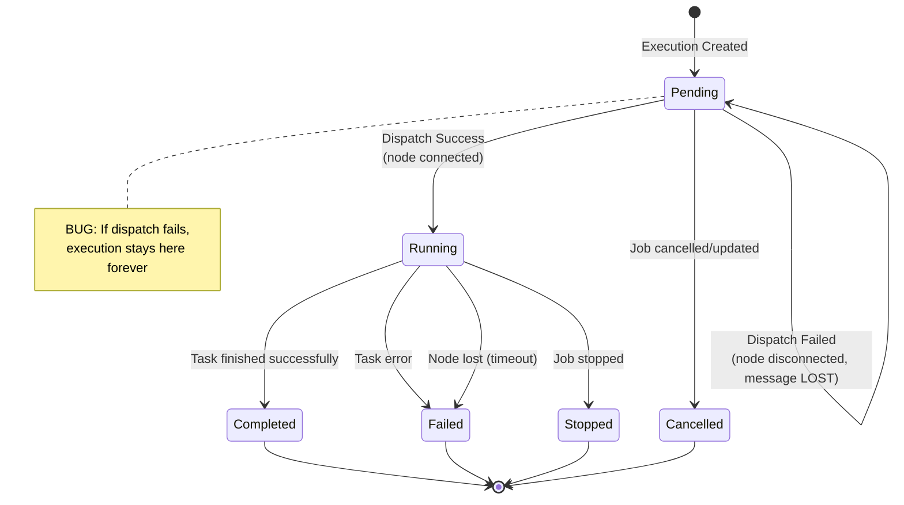
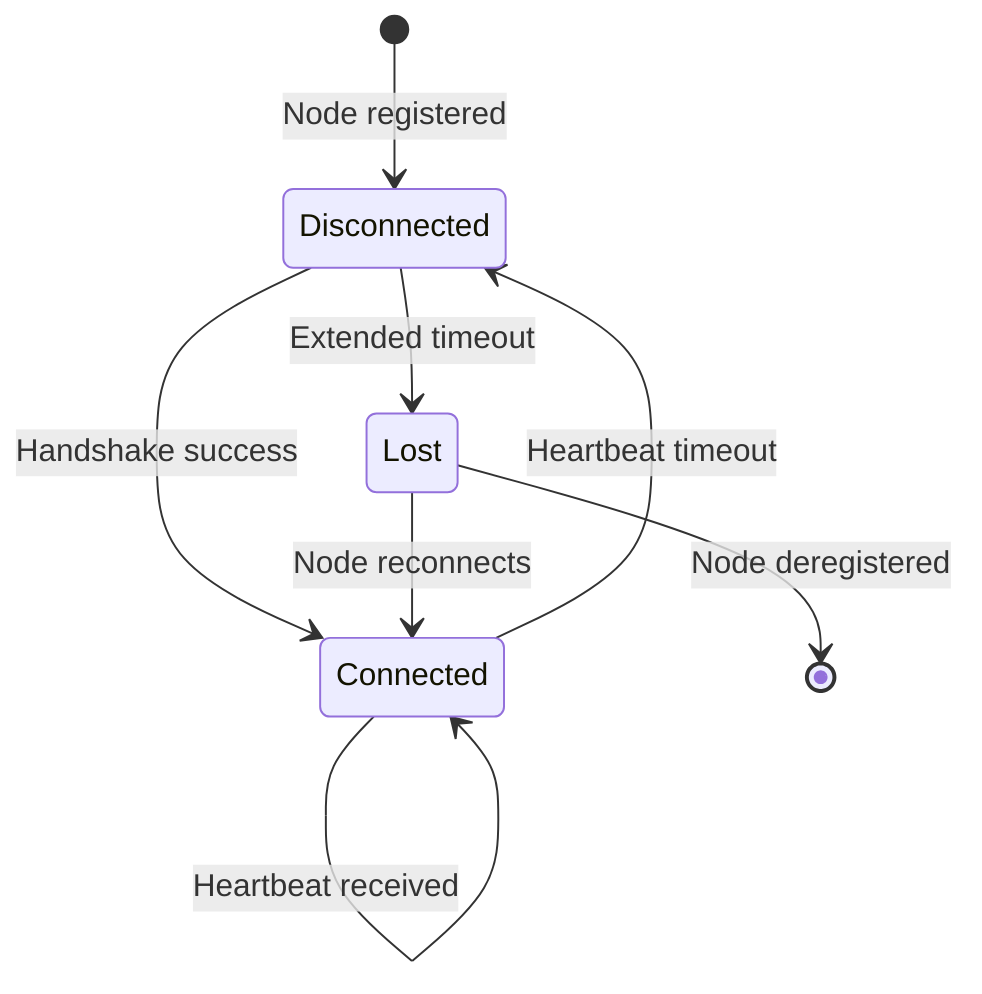
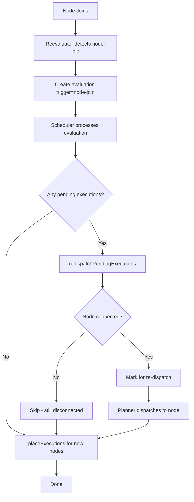

# Repro: Pipeline Jobs Stuck in 'deploying' State

Minimal reproduction for [expanso-io/expanso#395](https://github.com/expanso-io/expanso/issues/395).

## Repository Contents

| Path | Description |
|------|-------------|
| `bin/` | Pre-built instrumented binaries (LFS-managed) with debug logging |
| `patches/fix-395-retry-strategy.patch` | **Proposed fix** with two approaches and unit tests |
| `docker/` | Dockerfiles for orchestrator and edge |
| `pipelines/` | Test job definitions |
| `docker-compose.debug.yml` | Local debug stack configuration |

## The Bug

Jobs get stuck in `deploying` state with executions stuck in `pending` state.

### Scenario 1: Pending executions not dispatched when nodes reconnect

1. Job deployed while node is disconnected
2. Execution created in database (`DesiredState=Running`, `ComputeState=Pending`)
3. Dispatcher tries to send message → node not connected → **message LOST**
4. Node reconnects
5. Reevaluator creates evaluation (`trigger=node-join`)
6. Scheduler sees execution already exists → does nothing
7. **Execution stuck forever in 'pending'**

### Scenario 2: New nodes don't get executions for "run on all nodes" jobs

1. Job says "run on all matching nodes" (daemon job)
2. 10 nodes connected → 10 executions created and running
3. 5 new nodes join the cluster
4. Job should now have 15 executions (one per matching node)
5. **New nodes never get executions** if scheduler doesn't properly handle node-join

## Root Cause

**File:** `orchestrator/internal/transport/dispatcher.go:54`

```go
watcher.WithRetryStrategy(watcher.RetryStrategySkip),  // ← THE BUG
```

The dispatcher uses `RetryStrategySkip` - execution assignments are lost when nodes aren't connected. When nodes reconnect:
1. Reevaluator creates new evaluations (trigger=node-join)
2. Scheduler sees executions already exist (desired=running, state=pending)
3. No re-dispatch occurs - the execution messages were already "sent"
4. Job stuck forever in `deploying` with executions in `pending`

### Why This Happens: The 5-Minute Disconnect Window

The orchestrator has a **5-minute disconnect timeout** ([defaults.go:51-59](https://github.com/expanso-io/expanso/blob/7ba54d408975774e5d91da162bfc303c91c11f08/orchestrator/pkg/config/defaults.go#L51-L59)). During this window:

1. Node actually disconnects (network failure, restart, etc.)
2. **Orchestrator still believes node is connected** (hasn't hit timeout yet)
3. User deploys a new job during this window
4. Execution created, dispatch message sent to NATS
5. **Message lost** - no subscriber (node is actually offline)
6. After 5 minutes, orchestrator marks node as disconnected
7. Node reconnects - but execution stays stuck in `pending`

This is a **known limitation** pending periodic and on-reconnect state reconciliation between edge and orchestrator. The current system is purely event-based without reconciliation on reconnect.

### Cascading Failure: Stuck Executions Block Future Jobs

**Critical:** A stuck pending execution doesn't just affect one job - it **blocks ALL future jobs** to that node.

Why: The scheduler's `nodesToAvoid()` function (reconciler.go:1368) checks for non-terminal executions:
```go
// Non-terminal executions always block (job is running/pending)
if !exec.IsTerminal() {
    result[exec.NodeID] = true
    continue
}
```

Since `Pending` is non-terminal, **any new job will skip that node** until the stuck execution is manually resolved.

### Bidirectional Message Loss

The same issue affects edge→orchestrator messages:
- Edge completes/fails a job while temporarily disconnected
- Status update message sent to NATS but orchestrator doesn't receive it
- Orchestrator thinks execution is still running when it's actually done

## Proposed Fix

See [`patches/fix-395-retry-strategy.patch`](patches/fix-395-retry-strategy.patch) for full details with unit tests.

### Approach A: Change retry strategy (simple but risky)

```diff
-    watcher.WithRetryStrategy(watcher.RetryStrategySkip),
+    watcher.WithRetryStrategy(watcher.RetryStrategyBlock),
```

**Pros:** One-line fix
**Cons:** Could block dispatcher if node never returns

### Approach B: Re-dispatch on node-join (recommended)

When a node joins, the scheduler should:
1. Find pending executions targeted at that node
2. Re-dispatch them

```go
// In reconciler.go - on node-join evaluation:
func (e *Reconciler) redispatchPendingExecutions() error {
    pendingExecs := e.allExecutions.filter(isPendingWithDesiredRunning)
    for _, exec := range pendingExecs {
        if nodeIsConnected(exec.NodeID) {
            e.plan.MarkForRedispatch(exec.ID)
        }
    }
}
```

**Pros:** Self-healing, works after restarts, no blocking
**Cons:** More code changes required

---

## State Machine & Edge Cases

### Execution State Transitions



### Node Connection States



### Edge Cases Matrix

| Scenario | Current Behavior | Expected Behavior | Status |
|----------|------------------|-------------------|--------|
| **Node Join - New Node** | | | |
| Daemon job running, new node joins | Reevaluator triggers eval → Scheduler creates new execution | Same | ✅ Works |
| **Node Join - Reconnection** | | | |
| Pending execution exists, node reconnects | Eval triggered → Scheduler sees exec exists → No action | Should re-dispatch pending execution | ❌ **BUG** |
| Running execution exists, node reconnects | Eval triggered → No change needed | Same | ✅ Works |
| **Node Leave - Temporary** | | | |
| Node disconnects briefly | Execution continues (optimistic) | Same | ✅ Works |
| **Node Leave - Lost** | | | |
| Node exceeds lost timeout | Execution marked Failed | Same | ✅ Works |
| **Job Deploy - All Nodes Connected** | | | |
| Deploy job, all nodes online | Executions created and dispatched | Same | ✅ Works |
| **Job Deploy - Some Nodes Disconnected** | | | |
| Deploy job, some nodes offline | Executions created, dispatch fails silently | Should retry on reconnect | ❌ **BUG** |
| **Job Deploy - No Nodes** | | | |
| Deploy job, zero nodes | Job queued, waiting | Same | ✅ Works |
| **Scaling Up** | | | |
| Add 5 nodes to running daemon job | Reevaluator triggers eval → 5 new executions | Same | ✅ Works (if matchingNodes correct) |
| **Scaling Down** | | | |
| Remove 5 nodes from running daemon job | Executions on lost nodes → Failed | Same | ✅ Works |

### Detailed Scenarios

#### Scenario A: Deploy While Node Disconnected

```
Timeline:
─────────────────────────────────────────────────────────────────────
t0: Node-1 connected, Node-2 disconnected
t1: User deploys daemon job (should run on all nodes)
t2: Scheduler creates Exec-1 (Node-1) and Exec-2 (Node-2)
t3: Dispatcher sends to Node-1 → SUCCESS → Exec-1 Running
t4: Dispatcher sends to Node-2 → FAIL (disconnected) → MESSAGE LOST
t5: Exec-2 stays Pending forever
t6: Node-2 reconnects
t7: Reevaluator creates evaluation (trigger=node-join)
t8: Scheduler processes eval, sees Exec-2 exists → DOES NOTHING ❌
t9: Exec-2 still Pending, Job stuck in "deploying"

Expected at t8: Scheduler should re-dispatch Exec-2 to Node-2
```

#### Scenario B: New Node Joins Running Job

```
Timeline:
─────────────────────────────────────────────────────────────────────
t0: Daemon job running on Node-1, Node-2 (2 executions)
t1: Node-3 joins cluster
t2: Reevaluator detects node-join, creates evaluation
t3: Scheduler processes eval
t4: matchingNodes() returns [Node-1, Node-2, Node-3]
t5: Scheduler sees Node-3 has no execution → creates Exec-3 ✅
t6: Dispatcher sends to Node-3 → SUCCESS
t7: Job now running on 3 nodes

This scenario works correctly IF matchingNodes() properly includes new node.
```

#### Scenario C: Node Briefly Disconnects Then Reconnects

```
Timeline:
─────────────────────────────────────────────────────────────────────
t0: Job running on Node-1 (Exec-1 Running)
t1: Node-1 disconnects (network blip)
t2: Exec-1 still Running (optimistic, waiting for heartbeat timeout)
t3: Node-1 reconnects before timeout
t4: Reevaluator creates evaluation (trigger=node-join)
t5: Scheduler processes eval, Exec-1 still Running → no action needed ✅
t6: Everything continues normally

This scenario works correctly.
```

#### Scenario D: Node Lost (Extended Timeout)

```
Timeline:
─────────────────────────────────────────────────────────────────────
t0: Job running on Node-1 (Exec-1 Running)
t1: Node-1 disconnects
t2: Heartbeat timeout → Node-1 marked Disconnected
t3: Extended timeout → Node-1 marked Lost
t4: Reevaluator creates evaluation (trigger=node-leave)
t5: Scheduler processes eval
t6: failLostNodeExecutions() marks Exec-1 as Failed ✅
t7: placeExecutions() tries to find new node for replacement

This scenario works correctly.
```

### The Fix: Re-dispatch Flow



---

## Instrumented Binaries

The binaries in `bin/` include additional debug logging that references the source code locations:

**When publishing to a disconnected node** (`manager.go`):
```
PUBLISH: Node not connected - message will be LOST
  root_cause=orchestrator/internal/transport/dispatcher.go:54 uses RetryStrategySkip
  issue=github.com/expanso-io/expanso/issues/395
```

**When detecting stuck executions** (`reconciler.go`):
```
RECONCILER: STUCK EXECUTIONS DETECTED - dispatch may have failed
  root_cause=orchestrator/internal/transport/dispatcher.go:54 uses RetryStrategySkip
  dispatch_code=orchestrator/internal/transport/dispatcher.go:103 PublishAsync call
```

---

## Reproduce (Local Instrumented Build)

Use locally-built debug images with added logging to trace the issue.

### Prerequisites

Place cross-compiled Linux binaries in `./bin`:
- `bin/expanso-orchestrator`
- `bin/expanso-edge`
- `bin/expanso-cli`

### Build & Run

```bash
# Build Docker images from instrumented binaries
./build-debug.sh

# Start local stack (in background)
docker compose -f docker-compose.debug.yml up -d
```

### Reproduce the bug

```bash
# 1. Verify nodes connected
docker exec orchestrator-debug expanso-cli node list

# 2. Deploy a working job (optional - proves things work)
docker cp pipelines/test-job.yaml orchestrator-debug:/tmp/
docker exec orchestrator-debug expanso-cli job deploy /tmp/test-job.yaml
docker exec orchestrator-debug expanso-cli execution list
# Executions should be "running"

# 3. Kill edges
docker rm -f edge1-debug edge2-debug

# 4. Deploy NEW job while edges are dead
docker cp pipelines/new-job.yaml orchestrator-debug:/tmp/
docker exec orchestrator-debug expanso-cli job deploy /tmp/new-job.yaml

# 5. Restart edges
docker compose -f docker-compose.debug.yml up -d edge1 edge2
sleep 20  # Wait for reevaluator batch (15s delay)

# 6. Check state - new job is STUCK
docker exec orchestrator-debug expanso-cli job list
# new-test-job shows "deploying" instead of "running"

docker exec orchestrator-debug expanso-cli execution list
# new-test-job executions show state=pending, desired=running
```

### Expected vs Actual

**Expected:** After nodes reconnect, scheduler should re-dispatch execution requests for pending executions.

**Actual:** Executions remain in `pending` state forever. The dispatch event was consumed and lost.

### Log Patterns to Watch

```bash
docker logs orchestrator-debug 2>&1 | grep -E "(DISPATCH|PUBLISH|leave)"
```

**Success path (nodes connected):**
```
DISPATCH: Attempting to send message
PUBLISH: connection_exists=true connection_alive=true
```

**Failure path (nodes dead but orchestrator doesn't know yet):**
```
DISPATCH: Attempting to send message
PUBLISH: connection_exists=true connection_alive=true
# (Message sent to NATS but no subscriber - lost forever)
```

**Recovery that doesn't happen:**
```
REEVALUATOR: Created evaluation for job (trigger=node-join)
# Scheduler processes evaluation but doesn't re-dispatch
# No new DISPATCH logs for the stuck job
```

### Debug Cleanup

```bash
docker compose -f docker-compose.debug.yml down -v
```

---

## Extended Scenario: Cascading Node Blocking

This scenario demonstrates that a stuck pending execution **blocks all future jobs** to that node.

### Reproduce the cascading failure

```bash
# 1. Start with clean environment
docker compose -f docker-compose.debug.yml up -d
sleep 10

# 2. Verify nodes are connected
docker exec orchestrator-debug expanso-cli node list
# Should show edge1-debug and edge2-debug as connected

# 3. Deploy first job (proves things work)
docker cp pipelines/test-job.yaml orchestrator-debug:/tmp/
docker exec orchestrator-debug expanso-cli job deploy /tmp/test-job.yaml
sleep 5
docker exec orchestrator-debug expanso-cli execution list
# Both nodes should have running executions

# 4. Kill edges WITHOUT waiting for orchestrator to detect
docker rm -f edge1-debug edge2-debug

# 5. IMMEDIATELY deploy second job (within 5-min timeout window)
docker cp pipelines/new-job.yaml orchestrator-debug:/tmp/
docker exec orchestrator-debug expanso-cli job deploy /tmp/new-job.yaml

# 6. Check executions - new-test-job has pending executions
docker exec orchestrator-debug expanso-cli execution list
# new-test-job executions show state=pending, desired=running

# 7. Restart edges and wait for reconnection
docker compose -f docker-compose.debug.yml up -d edge1 edge2
sleep 30

# 8. PROBLEM 1: new-test-job is STILL stuck
docker exec orchestrator-debug expanso-cli job list
# new-test-job still shows "deploying"
docker exec orchestrator-debug expanso-cli execution list
# new-test-job executions STILL show state=pending

# 9. Deploy THIRD job to demonstrate cascading failure
cat > /tmp/third-job.yaml << 'EOF'
name: third-test-job
type: pipeline
config:
  input:
    generate:
      count: 0
      interval: 5s
      mapping: |
        root.message = "THIRD JOB"
  pipeline:
    processors:
      - mapping: |
          root = this
  output:
    stdout:
      codec: lines
EOF
docker cp /tmp/third-job.yaml orchestrator-debug:/tmp/
docker exec orchestrator-debug expanso-cli job deploy /tmp/third-job.yaml

# 10. PROBLEM 2: Third job ALSO gets stuck because nodes are "blocked"
docker exec orchestrator-debug expanso-cli job list
# third-test-job shows "deploying" or "queued"

docker exec orchestrator-debug expanso-cli execution list | grep third
# No executions created for third-test-job on blocked nodes!
```

### What's happening

```
Timeline:
─────────────────────────────────────────────────────────────────────
t0: edges connected, orchestrator knows they're connected
t1: edges actually die (docker rm)
t2: orchestrator still thinks edges are connected (5-min timeout not hit)
t3: new-test-job deployed, executions created
t4: dispatch messages sent to NATS → LOST (no subscribers)
t5: new-test-job stuck: executions pending, desired=running
t6: edges restart and reconnect
t7: scheduler sees pending executions exist → does nothing
t8: third-test-job deployed
t9: scheduler checks nodesToAvoid() → nodes have pending executions
t10: scheduler skips both nodes → third-test-job can't run ANYWHERE

CASCADING FAILURE: One stuck job blocks ALL future jobs on those nodes!
```

### Verify the blocking behavior

```bash
# Check which nodes are being avoided
docker logs orchestrator-debug 2>&1 | grep -E "(STUCK|nodesToAvoid|skipping)"

# The scheduler log should show:
# "RECONCILER: STUCK EXECUTIONS DETECTED"
# followed by new jobs being placed on zero nodes
```

---

## Reproduce (Against Expanso Cloud)

```bash
# Setup
cp .env.example .env  # add your bootstrap token
docker compose up -d

# 1. Create nodes
expanso-cli node list --endpoint $EXPANSO_ENDPOINT

# 2. Schedule job via UI -> works

# 3. Kill nodes
docker rm -f edge1 edge2

# 4. Deploy NEW job via UI while nodes dead

# 5. Start nodes
docker compose up -d

# 6. Job stuck in deploying
```

### Cleanup

```bash
docker compose down -v
```
